# Architecture — Runtime Data Flow

```mermaid
flowchart TB
    subgraph SDK["SDK Layer"]
        SC["SearchClient"]
        IDX["SearchIndex"]
    end

    subgraph ORCH["Orchestration — The Harness"]
        ANALYZER["QueryAnalyzer\nclassify · extract · detect ambiguity"]

        subgraph LOOP["Iteration Loop · max 2-3 steps · max 2 branches · original query preserved"]
            PLANNER["SearchPlanner"]
            EXECUTOR["Executor"]
            EVALUATOR["ResultEvaluator"]
        end

        FOLLOWUP["FollowUpGenerator"]
    end

    subgraph MODEL["Model Layer"]
        LLM["ModelProvider"]
    end

    subgraph ADAPTER["Adapter Layer"]
        PROTOCOL["SearchAdapter Protocol"]
        INMEM["InMemoryAdapter"]
        TS["TypesenseAdapter"]
    end

    subgraph TRACE["Trace / Telemetry Layer"]
        TRACER["Tracer"]
        EVENTS["Events"]
    end

    subgraph RESULT["Result"]
        ENVELOPE["SearchResultEnvelope\nstatus · results · branches · original_query · trace_id"]
    end

    SC --> IDX

    IDX -->|"search(query)"| ANALYZER
    ANALYZER -.->|uses| LLM
    ANALYZER -->|"QueryAnalysis + original query"| PLANNER

    PLANNER -->|SearchPlan| EXECUTOR
    PLANNER -.->|uses| LLM
    EXECUTOR -->|BackendSearchRequest| PROTOCOL
    PROTOCOL --> INMEM
    PROTOCOL --> TS
    EXECUTOR -->|"results + context"| EVALUATOR
    EVALUATOR -.->|uses| LLM

    EVALUATOR -->|"iterate: apply filters / branch / reformulate"| PLANNER
    EVALUATOR -->|"completed"| ENVELOPE
    EVALUATOR -->|"needs_input"| FOLLOWUP
    FOLLOWUP --> ENVELOPE

    ANALYZER -.->|step| TRACER
    PLANNER -.->|step| TRACER
    EXECUTOR -.->|step| TRACER
    EVALUATOR -.->|step| TRACER
    TRACER --> EVENTS
    TRACER -.->|trace_id| ENVELOPE
```

## How the Harness Works

The harness treats search as an **iterated decision process**, not a single-pass pipeline. Query analysis feeds the first iteration, and then the system loops — bounded and observable — until it has a good answer or exhausts its budget.

### The iteration loop is the core mechanism

1. **SearchPlanner** decides the next action: direct search, search with filters, branch, or escalate
2. **Executor** translates the plan into a backend request via the adapter protocol
3. **ResultEvaluator** assesses results and makes the stopping decision: completed, needs_input, or iterate

The loop runs at most 2-3 iterations with at most 2 branches. The original query is preserved through every iteration — reformulations are additive (new branches), never substitutive.

### Query analysis feeds the loop

**QueryAnalyzer** runs once at the start. It classifies the query, extracts entities, detects ambiguity, and proposes filters. Its output — a `QueryAnalysis` plus the preserved original query — is the input to the first planning step. The analyzer is a component serving the loop, not the identity of the system.

### Two modes govern the evaluator's response to uncertainty

The **interaction mode** (HITL or AITL) determines what happens when the evaluator encounters ambiguity or weak results:

| Situation | HITL | AITL |
|---|---|---|
| Ambiguity detected | Return `needs_input` immediately | Try to resolve within budget, escalate if it can't |
| Weak results | Return results with low confidence | Try filter augmentation or branching |
| Budget exhausted | N/A | Return best available results |

In HITL mode, the loop typically runs once — analyze, search, evaluate, return. In AITL mode, the evaluator may send control back to the planner for additional bounded steps.

### Every step is traced

The tracer captures each decision point: what the analyzer found, what the planner chose, what the executor ran, what the evaluator decided and why. Traces are a product feature — they ship in the `SearchResultEnvelope` alongside results.
